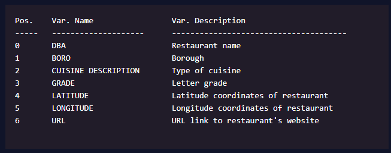

# Введение

## Обработка и упорядочивания данных

### Цели этого блока

Целью данного модуля является изучение распространенных отраслевых инструментов и передовых методов обработки и упорядочивания данных

После этого модуля вы сможете:
- Поймите разницу между обработкий данных и упорядочиванием данных
- Определите и выберите конкретные данные с помощью регулярных выражений
- Очистка наборов данных с помощью pandas
- Применяйте лучшие практики Tidy Data для упрощения анализа данных
- Начните развивать экспертные знания в области разведочного анализа данных

## Введение в обработку и упорядочивание данных

Часто при работе с данными мы сталкиваемся с неструктурированными и/или *`беспорядочными данными`*. Беспорядочные данные могут принимать различные формы. Это может означать любое из следующего:
- Столбцы неправильно маркированы или не имеют имен переменных
- Набор данных содержит бессмысленные данные
- Переменные хранятся как в столбцах, так и в строках

Хотя данные могут быть беспорядочными, они все еще чрезвычайно информативны. Нам нужно очищать, преобразовывать и иногда манипулировать структурой данных, чтобы получить какие-либо идеи. Этот процесс часто называют *`обработкой данных`*.

На последних этапах процесса обработки данных у нас будет набор данных, который мы можем легко использовать для моделирования или визуализации. Это *`аккуратный`* набор данных, где каждый столбец - это переменная, и каждая строка - это наблюдение.

## Обработка данных

Давайте рассмотрим подмножество проверок ресторанов, чтобы проработать некоторые процессы обработки данных. Данные включат семь различных столбцов с информацией о местоположении ресторана и проверке здоровья. Вот описание переменных набора данных.



Давайте воспользуемся *`read_csv()`* функцией в pandas, чтобы загрузить наш набор данных как фрейм данных pandas и посмотрим на первые 10 строк из 27.

```python
import pandas as pd
restaurants = pd.read_csv("DOHMH_restaurant_inspections.csv")

# the .head(10) function will show us the first 10 rows in our dataset
print(restaurants.head(10))
```


Метод *`.shape`* в pandas определяет количество строк и столбцов в нашем наборе данных как (строки, столбцы): `restaurants.shape`

`(27,7)`

Если внимательно посмотреть на таблицу, то можно увидеть некоторые пропущенные данные. В обоих столбцах *`GRADE`* и *`URL`* у нас есть пропущенные значения, отмеченные как NaN. В столбцах *`Latitude`* и *`Longitude`* у нас есть пропущенный набор координат, отмеченный как (0,000,0,000) для IHOP. (0,000,0,000) - это метка для пропущенных координат, поскольку ни один ресторан в Нью-Йорке не находится на экваторе. Другие распространенные индикаторы, используемые для пропущенных значений, - это значения, которые являются NA и -.

## Предварительная очистка данных

Также есть дубликаты строк для ресторана *`Seamore's`*. Чтобы удалить дубликаты строк, мы можем использовать *`drop_duplicates()`* функцию

```python
# the .drop_duplicates() function removes duplicate rows
restaurants = restaurants.drop_duplicates() 

# the .head(10) function will show us the first 10 rows in our dataset
print(restaurants.head(10))
```

Выход:


Еще раз метод *`.shape`*:

```python
restaurants.shape
```

Выход

```text
(25,7)
```

После удаления повторяющихся строк у нас осталось 25 строк, и теперь при просмотре первых 10 строк нашего набора данных внизу можно увидеть "YOLANDA RESTAURANT"

Если мы посмотрим на первые четыре  столбца наших данных: DBA, BORO, CUISINE DESCRIPTION и GRADE. Все эти имена столбцов написаны заглавными буквами, а следующие за ними столбцы используют как заглавные, так и строчные. Чтобы обеспечить некоторую согласованность в именах столбцов, мы переберем имена столбцов нашего набора данных и преобразуем их все в нижний регистр с помощью функций *`map()`* и *`lower()`*. Нам также нужно убедиться, что включена *`str`* функция, чтобы указать, что мы работает со строками

```python
# map() applies the str.lower() function to each of the columns in our dataset to convert the column names to all lowercase
restaurants.columns = map(str.lower, restaurants.columns)

# the .head(10) function will show us the first 10 rows in our dataset
print(restaurants.head(10))
```

Выход


Вы могли заметить, что первый столбец набора данных называется DBA, но мы знаем, что это столбец с названиями ресторанов. Мы можем использовать *`rename()`* функцию словарь, чтобы переименовать наши столбцы. Пока мы переименовываем наши столбцы, мы также можем захотеть сократить *`cuisine description`* столбец до *`cuisine`*.

```python
# axis=1` refers to the columns, `axis=0` would refer to the rows
# In the dictionary the key refers to the original column name and the value refers to the new column name {'oldname1': 'newname1', 'oldname2': 'newname2'}
restaurants = restaurants.rename({'dba': 'name', 'cuisine description': 'cuisine'}, axis=1)


# the .head(10) function will show us the first 10 rows in our dataset
print(restaurants.head(10))
```

Вывод


## Типы данных

Отлично! Теперь у нас есть набор данных, который чище и гораздо легче читать! Давайте рассмотрим типы данных каждого столбца, добавив их *`.dtypes`* в наш врейм данных pandas.

```python
restaurants.dtypes
```

Вывод


У нас есть два типа переменных: object и float64. *`object`* могут состоять из строк или смешанных типов (как числовых, так и нечислового) и *`float64`* являются числами с *`плавающей точкой`* (т.е. числами с десятичными знаками). Существуют и другие типы данных, такие как *`int64`* (целые числа), *`bool`* (значеия True/False) и *`datetime64`* (значения даты и/или времени).

Поскольку в наших данных имеются как непрерывные (float64), так и категориальные (object) переменные, может быть полезно посмотреть кол-во уникальных значений в каждом столбце с помощью *`nunique()`* функции.

```python
# .nunique() counts the number of unique values in each column 
restaurants.nunique() 
```

Выход


Мы видим, что наши данные состоят из 4 районов Нью-Йорк из 15 типов кухонь. Мы знаем, что у нас также есть недостающие данные из *`url`* нашего первоначального осмотра данных, поэтому уникальное кол-во значений *`url`* может быть не очень информативным. Кроме того, мы исправили дубликаты ресторанов, поэтому название ресторана, широта, долгота и URL должны быть уникальными для каждого ресторана (если, конечно, нет сетей ресторанов в разных местах)

## Отсутствующие данные

Из нашего первоначального осмотра данных мы знаем, что у нас есть пропущенные данные в *`grade, url, latitude и longitude`*. Давайте посмотрим, как данные отсутствуют, также называемые *`пропуском`*. Для этого мы можем использовать *`isna()`* для определенияЮ отсутствует ли значение. Это даст нам логическое значение и укажет, отсутствует ли наблюдения в этом столбце (True) или нет (False). Мы также будет использовать *`sum()`* для подсчета кол-ва пропущенных значений, где *`isna()`* возвращает True.

```python
# counts the number of missing values in each column 
restaurants.isna().sum() 
```

Выход


Мы видим, что в столбцах grade и url есть пропущенные значения, но нет пропущенных значений в *`latitude и longitude`*. Однако координаты в (0,000,0,000) недействительны для любого из ресторанов в нашем наборе данных и мы увидели, что они существуют в нашем первоначльном анализе. Чтобы справиться с этим, мы заменим координаты (0.000, 0.000) на значением NaN.

Мы будем использовать *`.where()`* метод из *`pandas`* библиотеки для замены недействительных координат. *`.where()`* метод сохраняет значения, указанные в первом аргументе, и зменяет все остальные значения на NaN.

```python
# here our .where() function replaces latitude values less than 40 with NaN values
restaurants['latitude'] = restaurants['latitude'].where(restaurants['latitude'] > 40) 

# here our .where() function replaces longitude values greater than -70 with NaN values
restaurants['longitude'] = restaurants['longitude'].where(restaurants['longitude'] < -70) 

# .sum() counts the number of missing values in each column
restaurants.isna().sum() 
```

Вывод


Мы видим, что большинство ресторанов в Манхэттене в нашем наборе данных имеют ссылки на рестораны, тогда как большинство ресторанов в Бруклине не имеют ссылок URL.

## Удаление префиксов

Возможно будет проще прочитать, что такое URL-ссылкиЮ удалив префиксы веб-сайтов, например, "https://www". Мы будем использовать *`str.lstrip()`* для удаления префиксов. Подобно тому, как мы работали с именами столбцов, нам нужно убедится, что включена *`str`* функция, чтобы определить, что мы работает со строками, и *`lstrip()`* удалить части строки с левой стороны.

```python
# .str.lstrip('https://') removes the “https://” from the left side of the string
restaurants['url'] = restaurants['url'].str.lstrip('https://') 

# .str.lstrip('www.') removes the “www.” from the left side of the string
restaurants['url'] = restaurants['url'].str.lstrip('www.') 

# the .head(10) function will show us the first 10 rows in our dataset
print(restaurants.head(10))
```

Вывод


## Аккуратные данные

Давайте рассмотрим набор данных, содержащий информацию о средней годовой заработной плате работников ресторанов в районах Нью-Йорка и в городе Нью-Йорке в целом за 2000 и 2007 годы. Данные взяты из квартальной переписки занятости и заработной платы Департамента труда штата Нью-Йорк и содержат всего шесть строк.

```python
annual_wage = pd.read_csv("annual_wage_restaurant_boro.csv")
print(annual_wage)
```

Вывод


В этом набре данных есть три переменные: *`borough, year, и average annual income`*. Однако у нас есть значения (2000 и 2007) в заголовках столбцов, а не имена переменных (*`year, average annual income`*). Это не идеально для работы, поэтому давайте исправим это! Мы воспользуемся *`melt()`* функцией в pandas, чтобы превратить текущие значения (2000 и 2007) в заголовках столбцов в значения строк и добавим *`year и avg_annual_wage`* в качестве меток столбцов.

```python
annual_wage=annual_wage.melt(

      # which column to use as identifier variables
      id_vars=["boro"], 
      
      # column name to use for “variable” names/column headers (ie. 2000 and 2007) 
      var_name=["year"], 

      # column name for the values originally in the columns 2000 and 2007
      value_name="avg_annual_wage") 

print(annual_wage)
```

Вывод


Теперь у нас есть аккуратный набор данных, где каждый столбец - это переменная (район, год или средняя годовая заработная плата), а каждая строка - это наблюдление! С этим набором данных будет гораздо проще работать в дальнейшем!

Теперь у вас есть инструмент для продолжения сбора дополнительной информации о ресторанах Нью-Йорка, чтобы ответить на вопросы, которые вам интересно изучить. Например, мы могли бы изучить, какие переменные являются наиболее прогнозируемыми для получения проходного балла по состоянию здоровья. Нам нужно будет собрать еще немного данных пройти процесс обработки данных, чтобы получить аккуратные данные, готовые к анализу.