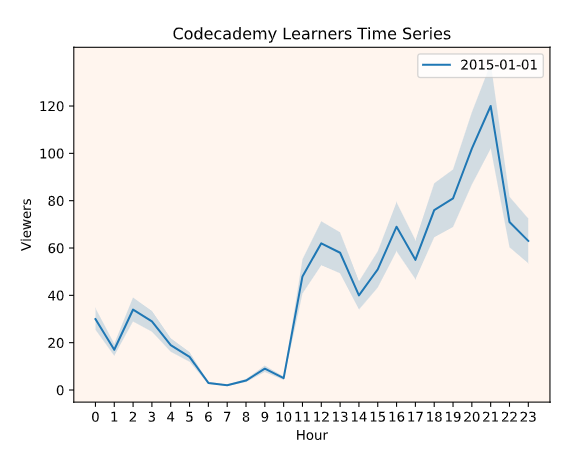

# Data Science ML Specialist

Машинное обучение является наиважнейшей наукой о данных, и является движущей силой многих технологий которые мы используем каждый день:
- Система рекомендаций
- Выявление заболеваний
- Обнаружение мошеничества
- Оптимизация маршрутов
- и многое многое другое

Общими словами это технологии представляющие то как данные влияют на нашу повседневную жизнь. 

## Один день из жизни стажера Специалиста по данным

### Специалисты по данным активно используют SQL

SQL (Structured Query Language) - это структурированный язык запросов который используется для получения данных из базданных.

DB (Database) - базы данных представляются собой хранилище информации которые собраны в таблицы.

Простой пример запроса на языке SQL

```SQL
-- Используя данный запрос можно получить все колонки (*) таблицы browse в кол-ве строк равному 10
SELECT * 
FROM browse 
LIMIT 10;
```

Используя тотже язые SQL можно писать и более сложные запросы. Допустим перед нами стоит задача изучить рейтинг оттока пользователей (отписок)

```sql
SELECT COUNT(DISTINCT user_id) AS 'enrollments',
  COUNT(CASE
       	WHEN strftime("%m", cancel_date) = '03'
        THEN user_id
  END) AS 'march_cancellations',
 	ROUND(100.0 * COUNT(CASE
       	WHEN strftime("%m", cancel_date) = '03'
        THEN user_id
  END) / COUNT(DISTINCT user_id)) AS 'churn_rate'
FROM pro_users
WHERE signup_date < '2017-04-01'
	AND (
    (cancel_date IS NULL) OR
    (cancel_date > '2017-03-01')
  );
```

### Основным языком программирования специалистов является Python

Основной причиной почему Python используют наибольшее специалостов данной профессии заключается в наличии у данного языка большой библиотеки. В том числе специальные готовые решения для анализа данных или построения машинных моделей обучения.

```python
# Один из примеров программ на Python
# Создаем списки
libraries = ["NumPy", "SciPy", "Pandas", "Matplotlib", "Seaborn"]
completion = [100, 100, 96, 0, 0]

# Добавляем к ним значения
libraries.append("scikit-learn")
completion.append(0)

# формируем вложенный список из списков содержащих элементы первого и второго списка
gradebook = list(zip(libraries, completion))

print("Lesson Completion Rates:")
print(gradebook)
print("\n")
```

### Pandas

Для анализа данных используется специальная библиотека Python - Pandas

С помощью нее очень легко читать файлы, очищать данные, анализировать и визуализировать итоги

```python
# Импортируем библиотеку
import pandas as pd

# Загружаем данные
df = pd.read_csv('data/page_visit.csv')

# Выводим первые 5 строк набора данных из файла
print(df.head())
```

### Matplotlib and Seaborn

Для визуализации данных используются другие библиотеки такие как Matplotlib и Seaborn

Библиотек у Python очень много и многие из них схожи какие то более удобные а какие то имеют дополнительные возможности

```python
# Импортируем необходимые библиотеки
from matplotlib import pyplot as plt
import pandas as pd
import numpy as np

# создаем объект класса range с кол-ом элементов 24
hour = range(24)

# создаем список
viewers_hour = [30, 17, 34, 29, 19, 14, 3, 2, 4, 9, 5, 48, 62, 58, 40, 51, 69, 55, 76, 81, 102, 120, 71, 63]

# даем заголовок графику
plt.title("Codecademy Learners Time Series")

# обозначаем наименования осей
plt.xlabel("Hour")
plt.ylabel("Viewers")

# создаем график
plt.plot(hour, viewers_hour)

# обозначаем пункты легенды
plt.legend(['2015-01-01'])

# создаем подграфик
ax = plt.subplot()

# указываем цвет
ax.set_facecolor('seashell')

# указываем шаг по оси Х
ax.set_xticks(hour)
# указываем шаш по оси Y
ax.set_yticks([0, 20, 40, 60, 80, 100, 120])

# указываем мультипликатор значений
y_upper = [i + (i*0.15) for i in viewers_hour]
y_lower = [i - (i*0.15) for i in viewers_hour]

# заполняем пространство между занчениями
plt.fill_between(hour, y_lower, y_upper, alpha=0.2)

# выводим график на экран
plt.show()
```

Результат кода выше на выходе



### Probability

Специалисты данной профессии также изучают вероятности

Очень часто прибегают к моделированию ситуации для выявления вероятности события.

Например какова вероятность того что в комнате будут находится два человека с одинаковой датой рождения? И возможно ли будет разместить кол-во гостей от каждого именниника в одной комнате ?

Задавая подобные вопросы специалисты моделируют ситуацию и выявляют вероятность события, и последствия от события